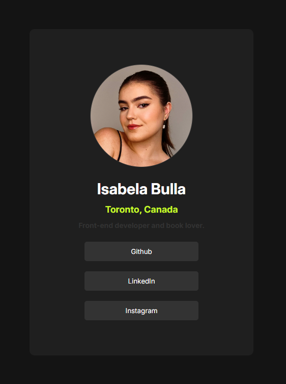

# Social Media Links

A simple website that displays picture, location, description and social media links of a person or business (in this case me 🙋🏻‍♀️).

**Link to project:** https://social-links-ten-mauve.vercel.app/

# How I'ts Made:

**Technologies used:** HTML, CSS

Firstly, I defined the structure an content of the website using HTML and than I styled it using CSS. I used a FrontEndMentor challenge as a reference for this project ( https://www.frontendmentor.io/challenges/social-links-profile-UG32l9m6dQ ).

# Lessons Learned:

I developed this project early on my studies, I believe the CSS styling was the biggest lesson out of it. You will notice that when hovering over the container a subtle shadow appears, and when hovering over the buttons a green border appears - without changing the size of the container.
